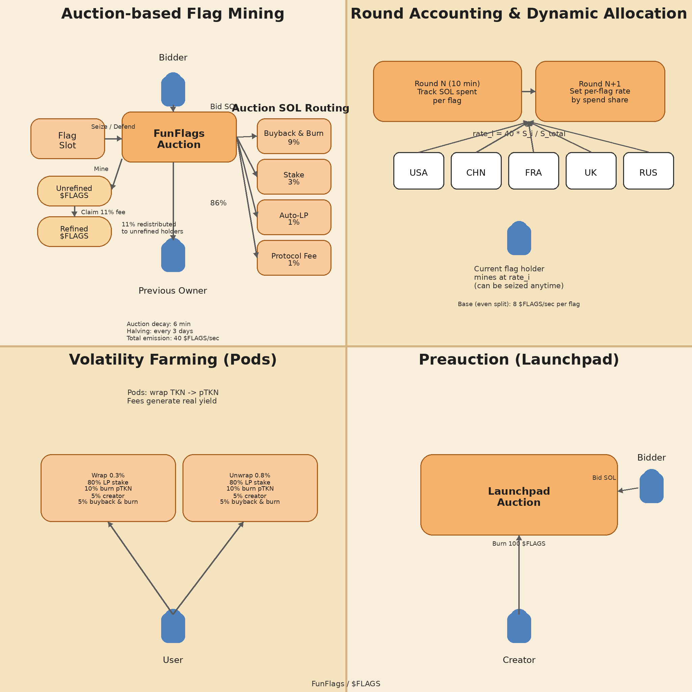

# FunFlags Whitepaper

FunFlags is an on-chain “meme mining” game on Solana. Players compete in continuous Dutch auctions to control **five flag slots** and mine **$FLAGS** under a **10‑minute round-based dynamic allocation** system.

  ⛏️ Auction-only mining
  🕒 6‑minute auction decay
  🧮 10‑minute rounds
  🔥 Buyback & burn

  

    <h3>At a glance</h3>
    

      
<b>5 flags</b>USA / China / France / UK / Russia

      
<b>Initial bid</b>0.12 SOL per flag

      
<b>Base rate</b>2.5 $FLAGS/sec per flag

      
<b>Total emission</b>12.5 $FLAGS/sec baseline

    

  

  

    <h3>How rewards get “fun”</h3>
    Your next-round mining rate is determined by **how much SOL was spent** on each flag in the previous round.  
    That makes competition shift across flags and creates a high-energy, meme-friendly meta.
  

## System diagram

> Tip: Want bigger text? Open `assets/styles.css` and increase `--base-font-size`.
